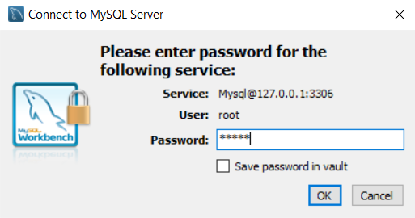
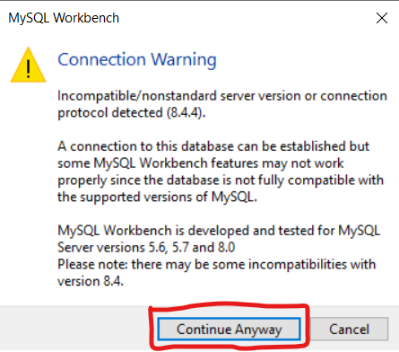
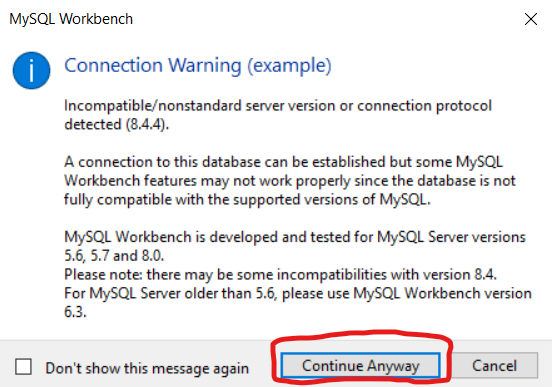

# NLW Connect - Java


## Tabela de conteúdos
- [Descrição](#descricao)
- [Pré-requisitos](#pre-requisitos)
- [Instalação](#instalação)
- [Utilização](#utilização)
- [API Endpoints](#api-endpoints)

<br>

## Descrição
Esse projeto é uma API de um sistema de inscrições em eventos feita com Java, Spring Boot e com MySQL como banco de dados. Essa API foi desenvolvida durante o evento da NLW Connect organizado pela Rocketseat e com as instruções do professor Isidro.

<br>

## Pré-requisitos

- Java 21
- Maven
- Docker
- MySQL Workbench 8.0
- Postman

> OBS: Você pode instalar o MySQL 8.0 na sua máquina em vez de utilizar o Docker, nesse caso você pode pular os passos 4 e 5 da instalação

<br>

## Instalação

1. Clone o repositório:

```bash
git clone https://github.com/renatonoronha/nlw-connect-java.git
```

2. Navegue para o diretório do projeto

```bash
cd nlw-connect-java.git
```

3. Instale as dependências com o Maven: 

```bash
mvn clean install
```

4. Navegue para o para a pasta "data":

```bash
cd events/src/main/java/br/dev/renatofreitas/events/data
```

5. Inicie o Docker e execute o comando:

```bash
docker compose up
```

6. Crie uma nova conexão no MySQL Workbench


<br>

- Para testar a conexão clique em test connection e digite a senha definida no arquivo docker-compose.yml: 'mysql'
- Caso você esteja utilizando o MySQL local utilize a senha que você definiu


<br>



<br>

- Se tudo der certo deve aparecer uma janela "Connection Warning", clique em Continue Anyway e então aparecerá outra janela informando que a conexão foi bem sucedida, clique em ok



<br>


<br>

- Clique em ok para criar a conexão


<br>


<br>

- Quando for entrar na conexão uma janela de "Connection Warning" aparecerá, clique em Continue Anyway
- Caso esteja utilizando o MySQL local essa janela não aparecerá



<br>

- Dentro da conexão você irá importar o arquivo db_events.sql que está dentro da pasta "data" deste projeto e executar o script


<br>


<br>

- No canto superior esquerdo, na janela "Navigator" as tabelas devem aparecer, caso não apareçam clique no botão de atualizar


<br>
<br>

Pronto seu banco de dados está configurado, agora a aplicação pode ser iniciada e as requisições podem ser enviadas pelo Postman

<br>

## Utilização
1. Inicie a aplicação com Maven
2. A API vai estar acessível no endereço web: http://localhost:8080

<br>

##  API Endpoints
### POST /events
Cria um novo evento

```
Requisição:

{ 
    "title":"CodeCraft Summit 2025", 
    "location":"Online", 
    "price":0.0, 
    "startDate":"2025-03-16", 
    "endDate":"2025-03-18", 
    "startTime":"19:00:00" 
    "endTime":"21:00:00" 
}
```

```
Resposta:

{ 
    "id": 1, 
    "title":"CodeCraft Summit 2025", 
    "prettyName":"codecraft-summit-2025", 
    "location":"Online",
    "price":0.0, 
    "startDate":"2025-03-16", 
    "endDate":"2025-03-18", 
    "startTime":"19:00:00", 
    "endTime":"21:00:00" 
}
```

### GET /events
Lista todos os eventos

```
Resposta:

[
	{ 
	    "id": 1, 
	    "title":"CodeCraft Summit 2025", 
	    "prettyName":"codecraft-summit-2025", 
	    "location":"Online", 
	    "price":0.0, 
	    "startDate":"2025-03-16", 
	    "endDate":"2025-03-18", 
	    "startTime":"19:00:00", 
	    "endTime":"21:00:00" 
	}, 
	... 
]
```

### GET /events/PRETTY_NAME
Recupera um evento pelo seu Pretty Name

```
Exemplo: http://localhost:8080/events/codecraft-summit-2025

Resposta:

{ 
    "id": 1, 
    "title":"CodeCraft Summit 2025", 
    "prettyName":"codecraft-summit-2025", 
    "location":"Online", 
    "price":0.0, 
    "startDate":"2025-03-16", 
    "endDate":"2025-03-18", 
    "startTime":"19:00:00", 
    "endTime":"21:00:00" 
}
```

### POST /subscription/PRETTY_NAME
Realiza a inscrição em um evento

```
Requisição esperada:

{ 
    "userName":"John Doe", 
    "email":"john@doe.com" 
}
```

```
Resposta esperada:

{ 
    "subscriptionNumber":1, 
    "designation": "https://devstage.com/codecraft-summit-2025/123" 
}
```

### GET /subscription/PRETTY_NAME/ranking
```
Exemplo: //localhost:8080/subscription/codecraft-summit-2025/ranking:

Resposta:

[ 
    { 
        "userName":"John Doe", 
        "subscribers":1000 
    }, 
    { 
        "userName":"Mary Page", 
        "subscribers":873 
    }, 
    { 
        "userName":"Frank Lynn", 
        "subscribers":690 
    }
]
```

### GET /subscription/PRETTY_NAME/ranking/USERID
Recupera o número de inscritos que efetivaram sua participação no evento indicados por um determinado usuário (UserId), bem como sua colocação no ranking geral

```
Exemplo: //localhost:8080/subscription/codecraft-summit-2025/ranking/123

Resposta:

{ 
    "rankingPosition":3, 
    { 
        "userId":123, 
        "name":"John Doe", 
        "count":600 
    } 
}
```

<br>

## Licença

Esse projeto possui a licença [MIT](./LICENSE)